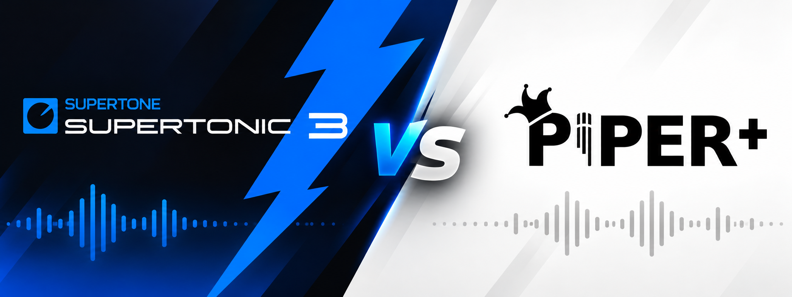
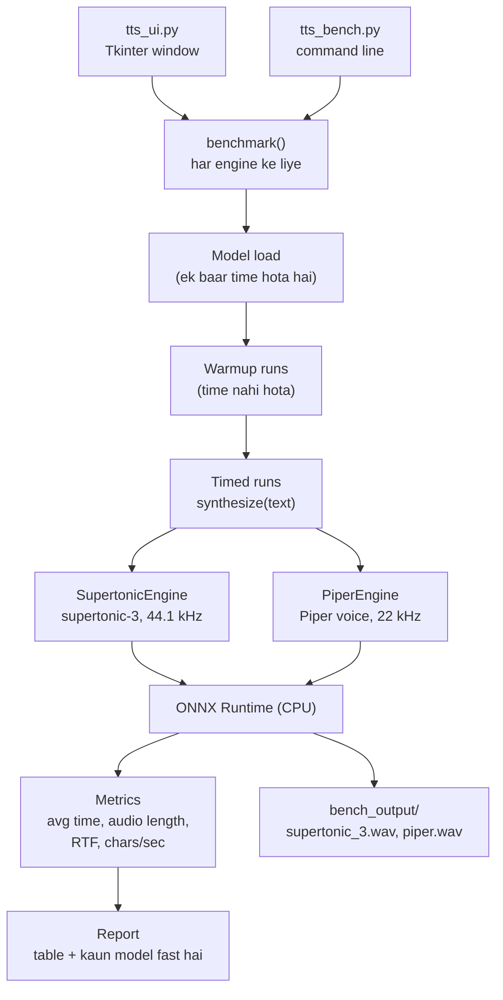

# Supertonic 3 vs Piper — TTS speed bench

[English](README.md) | **Hinglish**

Ye ek chhota test bench hai jo ek hi text ko do local text-to-speech models,
[Supertonic 3](https://github.com/supertone-inc/supertonic) aur
[Piper](https://github.com/OHF-Voice/piper1-gpl), se chalata hai aur dikhata hai ki kaun
audio jaldi banata hai. Dono CPU par ONNX Runtime se chalte hain. Hindi aur English pehle se set hain.


## Nateeja chhote me

Ek Windows 11 machine par, sirf CPU, Hindi text:

| Text | Supertonic 3 (8 steps) | Supertonic 3 (2 steps) | Piper |
|---|---|---|---|
| Chhota vaakya (~2 s audio) | naapa nahi | 229 ms | 66 ms |
| Lamba text (~8 s audio) | 1884 ms | 639 ms | 345 ms |

- **Piper fast hai**, Supertonic ki default settings par lagbhag 5–7x. Real-time kaam ke liye achha, jaise live translation.
- **Supertonic 3 ki awaaz zyada natural hai** (44.1 kHz, Piper ka 22 kHz) aur woh bhi real time se kai guna fast hai. Voice bot ke liye achha, kyunki wahan LLM hi zyada time leta hai.

Aapke hardware par numbers alag aayenge, isliye bench khud chala kar dekhiye.

## Setup

Python 3.10+ chahiye (3.13, Windows 11 par test kiya gaya).

```bash
pip install -r requirements.txt
```

Models pehli run par apne aap download hote hain: Supertonic 3 `~/.cache/supertonic3` me, Piper voices `piper_voices/` me.

## Use kaise karein

### UI

```bash
python tts_ui.py
```

Text likhiye, language chuniye, **Run test** dabaiye. Table me dono models ka synthesis time, audio length aur speed dikhti hai, aur do play buttons se dono ka audio sun sakte hain. UI playback ke liye `winsound` use karti hai, isliye sirf Windows par chalti hai.

### Command line bench

```bash
python tts_bench.py "नमस्ते, आप कैसे हैं?" --lang hi
python tts_bench.py "Hello, how are you today?" --lang en --runs 5
python tts_bench.py --file input.txt --lang hi
```

| Option | Matlab |
|---|---|
| `--lang` | Language code, `hi` (default) ya `en` |
| `--runs` | Har model ke kitne timed runs (default 3) |
| `--warmup` | Bina time naape warmup runs (default 1) |
| `--steps` | Supertonic ke denoising steps; kam steps = tez, default 8 |
| `--supertonic-voice` | `M1`–`M5` ya `F1`–`F5` |
| `--piper-voice` | Koi bhi Piper voice, jaise `hi_IN-priyamvada-medium` |
| `--threads` | Dono models ke liye CPU threads fix karo |
| `--only` | Sirf `supertonic` ya `piper` chalao |

Aakhri run ka audio `bench_output/` me save hota hai.

### Sirf text se audio

```bash
python supertonic_tts.py "नमस्ते, आप कैसे हैं?" --lang hi --voice F1 -o out.wav
```

## Ye kaam kaise karta hai



Har model ek chhoti engine class me lipta hai jisme ek jaisa `synthesize(text)` method hai,
isliye `benchmark()` dono ko ek hi tarah chalata hai: model load karo, ek warmup run karo,
phir asli runs ka time naap kar average nikalo. Voice download timing shuru hone se pehle
hota hai, to woh load time me nahi ginta.

**RTF** (real-time factor) = synthesis time / audio length. Jitna kam utna fast;
0.05 ka matlab ek second ka audio 50 ms me banta hai.

## Files

| File | Kya karti hai |
|---|---|
| `tts_bench.py` | Bench: engine classes, timing, report |
| `tts_ui.py` | Bench ke upar Tkinter UI |
| `supertonic_tts.py` | Supertonic 3 ka seedha text-to-WAV script |

## License

Is repo ka code [MIT License](LICENSE) ke under hai. Supertonic aur Piper ke apne alag
licenses hain (Piper GPL-3.0 hai), unhe use karne se pehle dekh lein.
