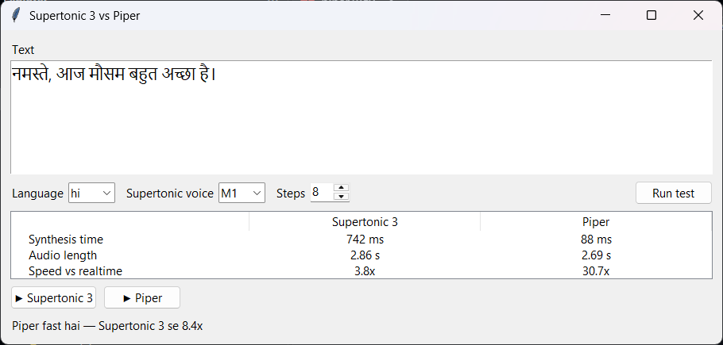
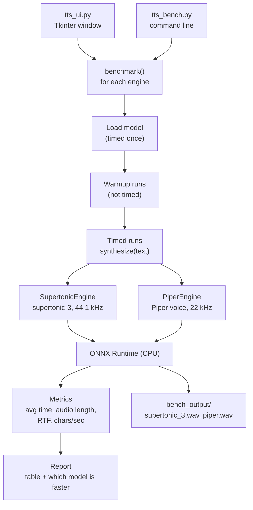

# Supertonic 3 vs Piper — TTS speed bench

**English** | [Hinglish](README.hinglish.md)

A small test bench that runs the same text through two local text-to-speech models,
[Supertonic 3](https://github.com/supertone-inc/supertonic) and
[Piper](https://github.com/OHF-Voice/piper1-gpl), and shows which one generates audio faster.
Both run on CPU with ONNX Runtime. Hindi and English are set up out of the box.



## Result in short

Measured on one Windows 11 machine, CPU only, Hindi text:

| Text | Supertonic 3 (8 steps) | Supertonic 3 (2 steps) | Piper |
|---|---|---|---|
| Short sentence (~2 s of audio) | not measured | 229 ms | 66 ms |
| Longer text (~8 s of audio) | 1884 ms | 639 ms | 345 ms |

- **Piper is faster**, about 5–7x at Supertonic's default settings. Good for real-time use such as live translation.
- **Supertonic 3 sounds more natural** (44.1 kHz vs Piper's 22 kHz) and is still several times faster than real time. Good for a voice bot, where the LLM is the slower part anyway.

Numbers will differ on your hardware, so run the bench yourself.

## Setup

Needs Python 3.10+ (tested on 3.13, Windows 11).

```bash
pip install -r requirements.txt
```

Models download automatically on first run: Supertonic 3 into `~/.cache/supertonic3`, Piper voices into `piper_voices/`.

## Usage

### UI

```bash
python tts_ui.py
```

Type text, pick the language, press **Run test**. The table shows synthesis time, audio length and speed for both models, and the two play buttons let you hear each result. The UI uses `winsound` for playback, so it is Windows-only.

### Command line bench

```bash
python tts_bench.py "नमस्ते, आप कैसे हैं?" --lang hi
python tts_bench.py "Hello, how are you today?" --lang en --runs 5
python tts_bench.py --file input.txt --lang hi
```

| Option | Meaning |
|---|---|
| `--lang` | Language code, `hi` (default) or `en` |
| `--runs` | Timed runs per model (default 3) |
| `--warmup` | Untimed warmup runs (default 1) |
| `--steps` | Supertonic denoising steps; fewer is faster, default 8 |
| `--supertonic-voice` | `M1`–`M5` or `F1`–`F5` |
| `--piper-voice` | Any Piper voice, e.g. `hi_IN-priyamvada-medium` |
| `--threads` | Fix the CPU thread count for both models |
| `--only` | Run just `supertonic` or `piper` |

The audio from the last run is saved in `bench_output/`.

### Text to speech only

```bash
python supertonic_tts.py "नमस्ते, आप कैसे हैं?" --lang hi --voice F1 -o out.wav
```

## How it works



Each model is wrapped in a small engine class with the same `synthesize(text)` method, so
`benchmark()` treats both the same way: load the model, do a warmup run, then time the
real runs and average them. Voice downloads happen before timing starts, so they do not
count as load time.

**RTF** (real-time factor) is synthesis time divided by audio length. Lower is faster;
0.05 means one second of audio takes 50 ms to generate.

## Files

| File | What it does |
|---|---|
| `tts_bench.py` | The bench: engine classes, timing, report |
| `tts_ui.py` | Tkinter UI on top of the bench |
| `supertonic_tts.py` | Simple Supertonic 3 text-to-WAV script |

## License

The code in this repo is under the [MIT License](LICENSE). Supertonic and Piper have their
own licenses (Piper is GPL-3.0), so check those before using them.
